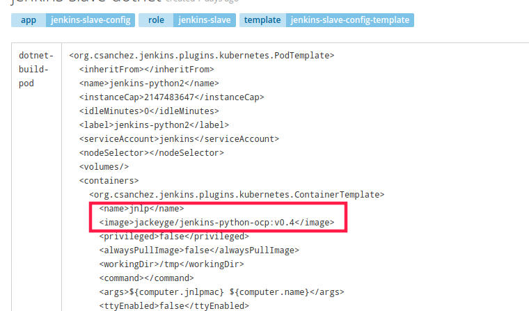

# jenkins-openshift-django

本文通过一个django demo程序，演示Jenkins结合openshift的CI/CD流程，是通过在源码外构建pipeline的方式，jenkins的pipeline调用Openshift的S2I、BC、DC等。

## 流程架构图

## 步骤

### 1、制作Jenkins slave镜像

由于此项目使用的是Python语言，过程中增加了单元测试，因此在openshift[官方基础镜像](https://github.com/openshift/jenkins/tree/master/slave-base)上做了修改，安装了一些需要的模块，通过[修改后的Dockerfile创建](./file/jenkins/slave-base/Dockerfile)Jenkins slave镜像。

### 2、启动Jenkins

- 通过openshift catalog 里的Jenkins模板启动Jenkins

- 登录Jenkins，安装Cobertura Plugin插件，用来展示Python代码测试覆盖率报表

- 在openshift导入Jenkins slave configmap [yaml文件](./file/jenkins/slave-base/openshift-jenkins-slave-pod-template.yaml),确保使用第一步创建的镜像

  

  

  

### 3、导入template

两种方式：

- 通过openshift catalog 里的django模块创建

- 通过[文件](./openshift/templates/django-postgresql.json)导入

导入成功会在openshift创建相应的bc、dc、service、router、ImageStreams等，导入过程会要求输入相应信息，确保bc的source为示例代码的地址。

### 4、导入Jenkins pipeline

在openshift导入Jenkins pipeline的bc

[yaml文件](./openshift/pipeline-bc.yaml)

导入后可在openshift和Jenkins看到相应信息

### 5、配置github webhook

为了启动自动构建，Jenkins需要在Hook URL中监听Github的Post请求。

- Jenkins 配置

**获取Jenkins的Hook URL，打开Jenkins首页控制台->系统管理->系统设置**

**选择github插件中的`高级`选项**

**启用webhook,复制生成的地址**

- github配置

**进入项目，选择settings**

**选择add webhook**

**填入刚才的地址**

- jenkins 项目配置

**进入项目选择`配置`**

**勾选build triggers 里的 `github hook trigger for GITScm polling` 选项**

### 6、测试流程

- 手动提交代码触发构建，查看Jenkins和openshift是否自动触发

- 通过Jenkins查看实时输出日志

- 流程结束

- 查看测试报告

- 访问

## 参考

[]: https://mp.weixin.qq.com/s/Q6mYo6f6qJ_GFdrmEGNALw
[]: http://mainframer.github.io/articles/Python%E6%8C%81%E7%BB%AD%E9%9B%86%E6%88%90.html

