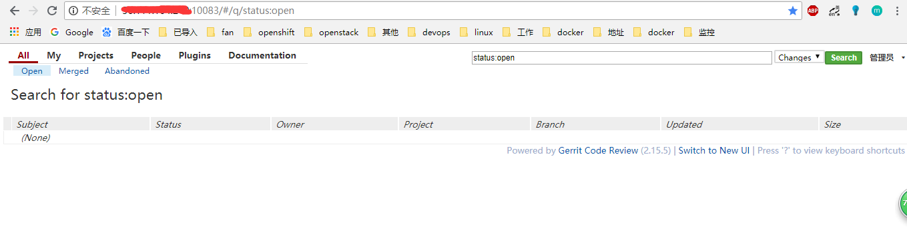
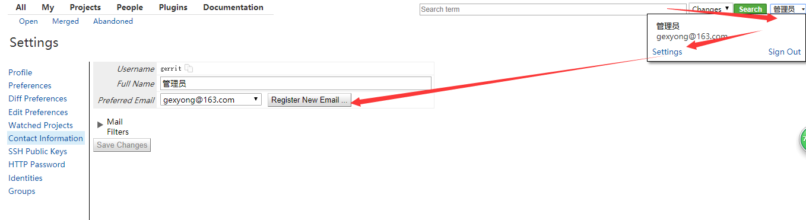
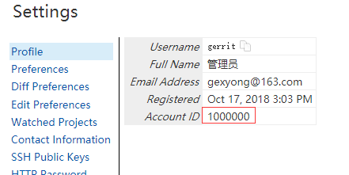
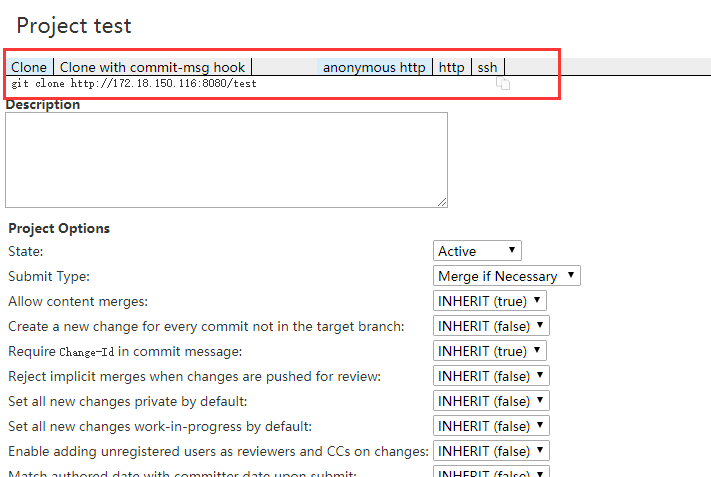

# gerrit 部署记录

>Gerrit 是一个基于 web 的代码评审工具, 它基于 git 版本控制系统。Gerrit 旨在提供一个轻量级框架, 用于在代码入库之前对每个提交进行审阅。‎‎更改将上载到 Gerrit, 但实际上并不成为项目的一部分, 直到它们被审阅和接受。它是标准开源过程的一个简单工具来支持提交补丁程序, 然后由项目成员在应用到代码库之前进行评审。‎Gerrit 首先是一个临时区域, 在提交的代码成为代码库的一部分之前, 可以对其修改进行检查。

## 工作原理


这是使用gerrit之前的架构，Gerrit取代了这个中央存储库并添加了一个额外的概念：一个待定更改存储。


使用Gerrit，当开发人员进行更改时，会将其发送到此待处理更改的商店，其他开发人员可以查看，讨论和批准更改。经过足够的审核人员批准后，更改将成为代码库的官方部分。

## 环境准备
- MySQL数据库-使用已有
```sql
mysql>create database gerritdb CHARACTER SET utf8 COLLATE utf8_general_ci;
mysql>grant all on gerritdb.* to 'gerrituser'@'%' identified by 'gerritpass';
```
- 新建gerrit用户
```bash
useradd gerrit
passwd gerrit
```
- 配置Java环境
```bash
tar zxf jdk-8u181-linux-x64.tar.gz -C /usr/local/

vim /etc/profile

export JAVA_HOME=/usr/local/jdk1.8.0_181
export JRE_HOME=/usr/local/jdk1.8.0_181/jre
export CLASSPATH=.:$JAVA_HOME/lib:$JRE_HOME/lib:$CLASSPATH
export PATH=$JAVA_HOME/bin:$JRE_HOME/bin:$PATH

source /etc/profile
```
- 安装git
`
 yum -y install git
`
- 下载gerrit
  http://gerrit-releases.storage.googleapis.com/index.html
## 安装部署
```bash
su - gerrit  #切换用户
mkdir gerrit_site
java jar gerrit-2.15.5.war init -d ~/gerrit_site   #安装
```
安装过程可能会遇到数据库表无法创建，可用管理员用户登录数据库执行`set global explicit_defaults_for_timestamp=1;`操作，如果还不行，可手动执行sql创建。

报错：
```
Exception in thread "main" com.google.gwtorm.server.OrmException: Cannot apply SQL
CREATE TABLE account_group_members_audit (
added_by INT DEFAULT 0 NOT NULL,
removed_by INT,
removed_on TIMESTAMP NULL DEFAULT NULL,
account_id INT DEFAULT 0 NOT NULL,
group_id INT DEFAULT 0 NOT NULL,
added_on TIMESTAMP NOT NULL
,PRIMARY KEY(account_id,group_id,added_on)
)
    at com.google.gwtorm.jdbc.JdbcExecutor.execute(JdbcExecutor.java:44)
    at com.google.gwtorm.jdbc.JdbcSchema.createRelations(JdbcSchema.java:134)
    at com.google.gwtorm.jdbc.JdbcSchema.updateSchema(JdbcSchema.java:104)
    at com.google.gerrit.server.schema.SchemaCreator.create(SchemaCreator.java:81)
    at com.google.gerrit.server.schema.SchemaUpdater.update(SchemaUpdater.java:108)

```
登录MySQL操作：
```sql
$ mysql -u root -p
Enter password: 
Welcome to the MySQL monitor.  Commands end with ; or \g.
Your MySQL connection id is 76
Server version: 5.7.20-0ubuntu0.16.04.1 (Ubuntu)

Copyright (c) 2000, 2017, Oracle and/or its affiliates. All rights reserved.

Oracle is a registered trademark of Oracle Corporation and/or its
affiliates. Other names may be trademarks of their respective
owners.

Type 'help;' or '\h' for help. Type '\c' to clear the current input statement.

mysql> set global explicit_defaults_for_timestamp=1;
Query OK, 0 rows affected (0.00 sec)

mysql> exit;
Bye

```
- 配置Nginx代理
```Script
server {
        listen       10083;
        location / {
          auth_basic              "Gerrit Code Review";

          auth_basic_user_file    /etc/nginx/conf.d/passwords; #用户认证文件路径 
          proxy_set_header        X-Forwarded-For $remote_addr;

          proxy_set_header        Host $host;
          proxy_pass http://10.150.1.99:8080; #gerrit地址
        }
}

```
- 创建admin用户
在Nginx服务器创建登录用户
由于使用的认证类型是http，所以以后创建用户都需要手动在此创建。
```bash
 htpasswd -c /etc/nginx/conf.d/passwords gerrit
```
## 配置修改

> vim review_site/etc/gerrit.config
```Script
[gerrit]
	basePath = git
	serverId = 1e6c64ad-57fe-4dcb-8c7b-1b8c36c2da48
	canonicalWebUrl = http://xxx.xxx.xxx.xxx:10083/  #nginx代理地址
[database]
	type = mysql
	hostname = xxx.xxx.xxx.xxx
	port = 3306
	database = gerritdb
	username = gerrit
[index]
	type = LUCENE
[auth]
	type = HTTP  #认证方式
[receive]
	enableSignedPush = false
[sendemail]      #发件邮箱设置，在安装过程已设置，如果没有可在此配置，密码存在secure.config文件
	smtpServer = smtp.sina.com
	smtpServerPort = 25
	smtpUser = send_not
        from = xxx@sina.com
[container]
	user = gerrit
	javaHome = /usr/local/jdk1.8.0_181/jre
[sshd]
	listenAddress = *:29418
[httpd]
	listenUrl = http://*:8080/
[cache]
	directory = cache
[plugins]
    allowRemoteAdmin = true

```

- 重启gerrit和Nginx‎
```bash
review_site/bin/gerrit.sh restart

nginx -s reload
```

## 登录验证

- 添加邮箱
 ID为1000000的是admin用户



## 安装插件
上面一键安装后，默认没有安装上任何插件的，如果用到插件，需要手动安装
- replication插件
> gerrit replication插件可以实现gerrit与gitlib同步

**安装：**
```bash
unzip gerrit-2.15.5.war
‎cp WEB-INF/plugins/replication.jar ~/temp/
ssh -p 29418 gerrit@127.0.0.1 gerrit plugin install -n replication.jar - <~/temp/replication.jar
ssh -p 29418 gerrit@127.0.0.1 gerrit plugin ls
```
**配置ssh config 示例**
```Script
cd ~/.ssh/
vim config
Host gitlab.***.cn
        User gitlabowner
        IdentityFile ~/.ssh/id_rsa #gitlab owner id_rsa
        StrictHostKeyChecking no
        UserKnownHostsFile /dev/null
```
**替换gitlab lubase(project owner) ssh key 示例**
```bash
cd ~/.ssh/
rm id_rsa
rm id_rsa.pub
vim id_rsa
(粘贴owner的id_rsa)
vim id_rsa.pub
(粘贴owner的id_rsa.pub)
 id_rsa
 id_rsa.pub
```
**加入gitlab pubkey到kown_hosts 示例**
```bash
sh -c "ssh-keyscan -t rsa gitlab.***.cn >> ~/.ssh/known_hosts"
sh -c "ssh-keygen -H -f ~/.ssh/known_hosts"
```
**配置replication.config 示例**
> vim gerrit_site/etc/replication.config
```Script
[remote "gitlab.***.cn"]
        url = git@gitlab.***.cn:mobile/${name}.git
        push = +refs/heads/*:refs/heads/*
        push = +refs/tags/*:refs/tags/*
        push = +refs/changes/*:refs/changes/*
        timtout = 30
        threads = 3
```
- download-commands插件
此插件可在项目界面显示clone地址

```
关于
该插件定义了用于下载不同下载方案中的更改/项目的命令（用于通过不同的网络协议下载）。

下载方案
此插件定义了以下下载方案。请注意，必须通过配置启用某些下载方案。

Anonymous Git：通过Git协议进行匿名下载的方案。

Anonymous HTTP：通过HTTP协议进行匿名下载的方案。

HTTP：通过HTTP协议进行身份验证下载的方案。

SSH：通过SSH协议进行身份验证下载的方案。
要求用户拥有用户名。

REPO：使用Repo工具下载的方案。

下载命令
此插件定义了以下下载命令。请注意，必须通过配置启用某些下载命令。

Git命令
所有Git命令都适用于Git命令行。Git的命令可用于的方案Anonymous Git，Anonymous HTTP，HTTP和SSH。

Checkout：用于获取和签出补丁集的命令。

Cherry-Pick：获取补丁集的命令，并将其挑选到当前提交中。

Format-Patch：用于获取修补程序集并将其提供给format-patch命令的命令。

Pull：用于拉取补丁集的命令。

回购命令
该Repo命令仅适用于该REPO方案。

Repo：使用Repo工具下载更改补丁集的命令。
克隆命令
此插件定义了以下克隆命令。

Clone：标准git clone命令。

Clone with commit-msg hook：标准git clone命令，其中包含将commit-msg挂接复制到新克隆的存储库的命令。
通过配置，可以指定启用哪些下载方案和命令。

配置必须gerrit.config在Gerrit服务器中完成。

部分下载
[download]
  command = checkout
  command = cherry_pick
  command = pull
  command = format_patch
  scheme = ssh
  scheme = http
  scheme = anon_http
  scheme = anon_git
  scheme = repo_download
下载部分配置允许的下载方法。

download.command
：应提供下载更改的命令。

Multiple commands are supported:

* `checkout`: Command to fetch and checkout the patch set.

* `cherry_pick`: Command to fetch the patch set and cherry-pick
it onto the current commit.

* `pull`: Command to pull the patch set.

* `format_patch`: Command to fetch the patch set and feed it
into the `format-patch` command.

If `download.command` is not specified, all download commands are
offered.
download.scheme
：应用于下载更改的方案。

Multiple schemes are supported:

* `http`: Authenticated HTTP download is allowed.

* `ssh`: Authenticated SSH download is allowed.

* `anon_http`: Anonymous HTTP download is allowed.

* `anon_git`: Anonymous Git download is allowed.  This is not
default, it is also necessary to set [gerrit.canonicalGitUrl]
(../../../Documentation/config-gerrit.html#gerrit.canonicalGitUrl)
variable.

* `repo_download`: Gerrit advertises patch set downloads with the
`repo download` command, assuming that all projects managed by this
instance are generally worked on with the repo multi-repository
tool.  This is not default, as not all instances will deploy repo.

If `download.scheme` is not specified, SSH, HTTP and Anonymous HTTP
downloads are allowed.
download.checkForHiddenChangeRefs
：隐藏更改引用时是否应调整下载命令。

Git has a configuration option to hide refs from the initial
advertisement (`uploadpack.hideRefs`). This option can be used to
hide the change refs from the client. As consequence fetching
changes by change ref does not work anymore. However by setting
`uploadpack.allowTipSHA1InWant` to `true` fetching changes by
commit ID is possible. If `download.checkForHiddenChangeRefs` is
set to `true` the git download commands use the commit ID instead
of the change ref when a project is configured like this.

Example git configuration on a project:

    [uploadpack]
      hideRefs = refs/changes/
      hideRefs = refs/cache-automerge/
      allowTipSHA1InWant = true

By default `false`.
```
**启动replication**
```bash
bin/gerrit.sh restart
ssh -p 29418 gerrit@127.0.0.1 gerrit plugin reload replication
ssh -p 29418 gerrit@127.0.0.1 replication start ***
```
## 其他
- [gerrit权限说明](./gerrit_access_controls.md)
- [gerrit对接gitlab](./gerrit_connect_gitlab.md)
- [gerrit对接jenkins](./gerrit_connect_jenkins.md)
## 参考
> http://www.cnblogs.com/kevingrace/p/5624122.html 
> 
>  https://www.bbsmax.com/A/mo5kYQWzwR/
> 
> https://blog.csdn.net/tq08g2z/article/details/78627653
> 
> https://gerrit-documentation.storage.googleapis.com/Documentation/2.15.3/intro-how-gerrit-works.html