# gerrit对接gitlab操作记录

## 1、Gitlab创建项目并把gerrit用户设置为管理员权限

- **新建群组**
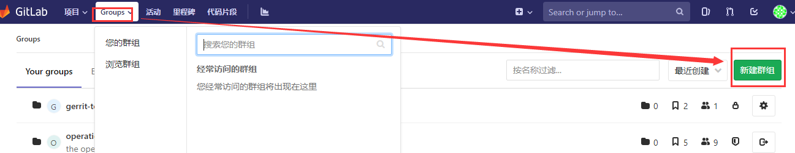
------
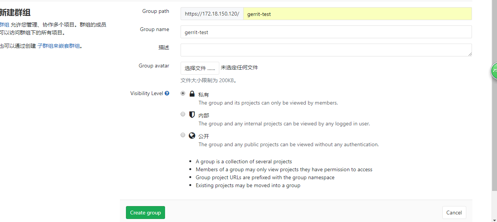
- **进入群组，新建项目**

------
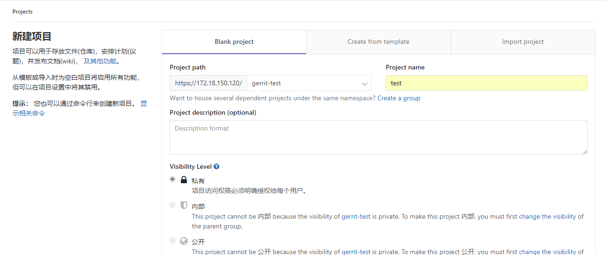
- **进入项目添加成员，gerrit用户给予maintainer权限，普通成员给予reporter权限**
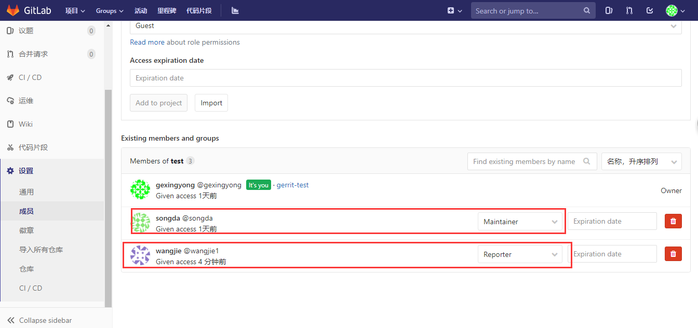

## 2、gerrit创建项目

- **新建项目**
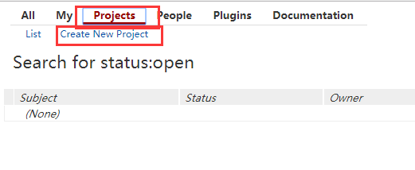
------
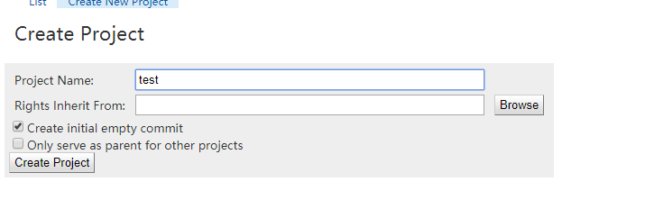
- **上传代码框架和基础代码,并创建.gitreview文件**
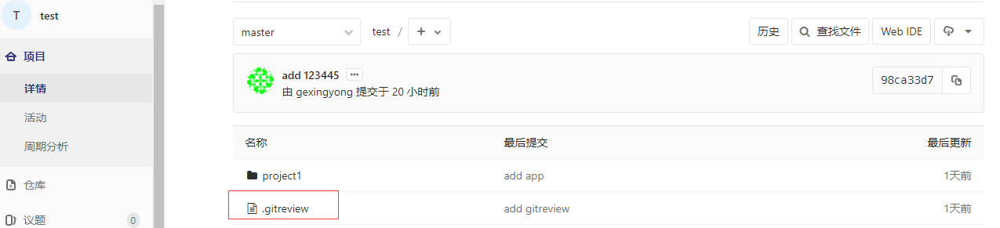
文件内容
```bash
[gerrit]
host=172.18.150.116  #gerrit服务器地址
port=29418           #gerrit自带ssh服务端口
project=test.git     #项目名
```
- **将项目成员添加到相应的用户组，用户需自行上传ssh公钥**
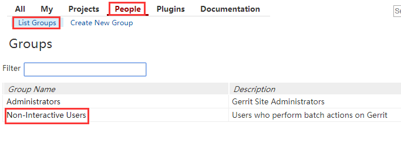
------
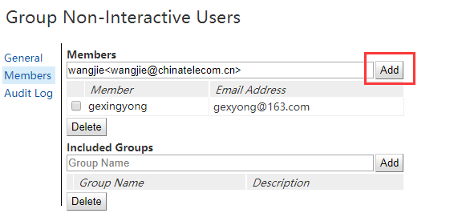

## 把代码同步到gerrit

```bash
[gerrit@115]$ cd /home/gerrit/gerrit_site/git/            //即登陆到gerrit安装目录的git下
[gerrit@115 git]$ rm -fr test-project1.git
[gerrit@115 git]$ git clone --bare git@xxx.xxx.xxx.xxx:dev-group/test-project1.git             //创建并将远程gitlab上的这个项目内容发布到gerrit上
[gerrit@115 git]$ ls
All-Projects.git test-project1.git
[gerrit@115 git]$ cd test-project1.git/ 
[gerrit@115 git]$ ls                                 //即test-project1工程和gerrit里默认的All-Projects.git工程结构是一样的了
branches config description HEAD hooks info objects packed-refs refs
```
## 3、gerrit同步gitlab配置
此配置依赖gerrit的replication插件
- **配置ssh config**
```bash
cd ~/.ssh/
vim config
Host gitlab.***.cn #gitlab 地址
        User gitlabowner #gitlab 管理员用户名
        IdentityFile ~/.ssh/id_rsa #gitlab 管理员私钥地址
        StrictHostKeyChecking no
        UserKnownHostsFile /dev/null

chmod 600 ~/.ssh/config   #修改文件权限
````
- **加入gitlab pubkey到kown_hosts 示例**
```bash
ssh-keyscan -t rsa gitlab.***.cn >> ~/.ssh/known_hosts
ssh-keygen -H -f ~/.ssh/known_hosts
```
- **配置replication.config**
```bash
vim gerrit_site/etc/replication.config

[remote "gitlab.***.cn"]
        url = git@gitlab.***.cn:mobile/${name}.git #gitlab项目组名/${name}表示该组下的所有项目
        push = +refs/heads/*:refs/heads/*
        push = +refs/tags/*:refs/tags/*
        push = +refs/changes/*:refs/changes/*
        timtout = 30
        threads = 3
```
- **重启**
```
bin/gerrit.sh restart
ssh -p 29418 gerrit@127.0.0.1 gerrit plugin reload replication
ssh -p 29418 gerrit@127.0.0.1 replication start ***
```

## 4、测试

- **从gitlab拉取代码**

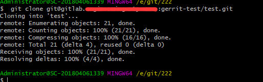

- **修改代码，并通过git review命令提交**

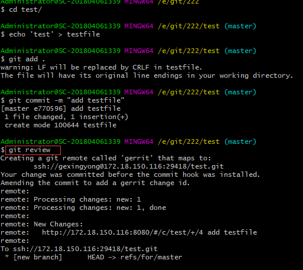

- **此时代码提交到gerrit，进入人工审核**

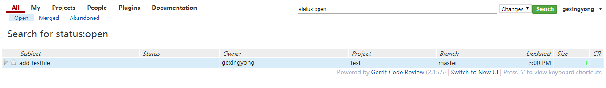
------
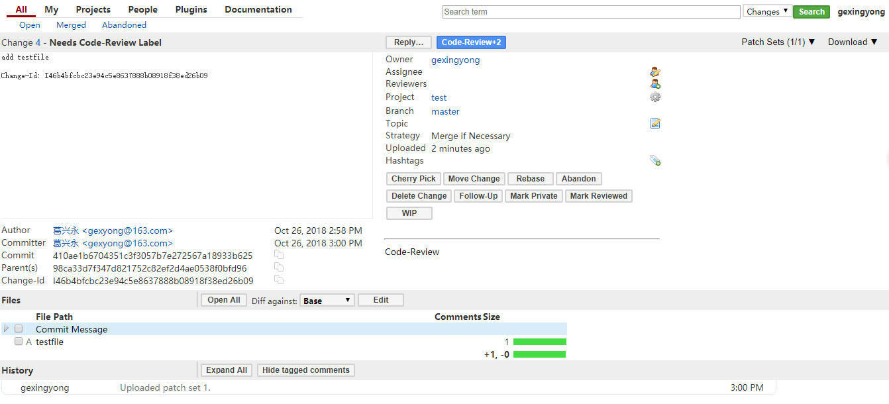

- **审核通过后merge到gitlab**

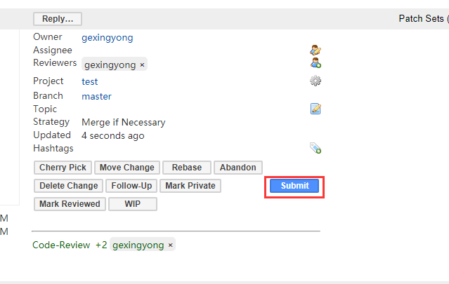
------
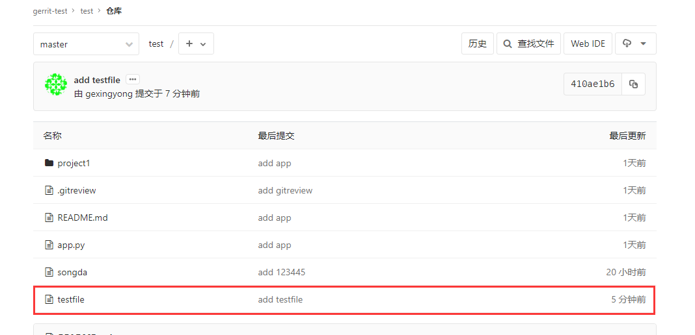

至此，gerrit对接gitlab流程测试结束。