# gerrit对接jenkins实现自动化测试

之前已经实现gerrit对接gitlab，实现人工代码审查，今天要做的是gerrit对接jenkins，实现代码提交后，触发jenkins流水线，jenkins通过sonar插件对代码进行自动化审查，单元测试等。

## gerrit配置
- **创建jenkins账号，并上传公钥**
  需要把jenkins用户加入到项目所对应的用户组
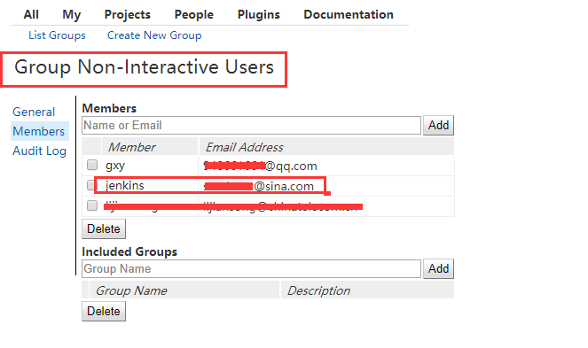
- **让Gerrit支持Jenkins**
如果安装Gerrit时没有或者没有选择添加Verified标签功能[‘lable Verified’]，需要自己添加。
具体可以登陆gerrit，ProjectS->list->All-Projects->Access->Edit->Add Permission 看里面是否有Verfied的选项
手动添加操作
```bash
# su - gerrit
$ git init cfg; cd cfg
$ git config --global user.name 'gerrit'
$ git config --global user.email 'gerrit@xxx.xxx'
$ git remote add origin ssh://gerrit@xxx.xxx.xxx.xxx:29418/All-Projects
$ git pull origin refs/meta/config
$ vim project.config
[label "Verified"]
    function = MaxWithBlock
    value = -1 Fails
    value = 0 No score
    value = +1 Verified
$ git commit -a -m 'Updated permissions'
$ git push origin HEAD:refs/meta/config
$ rm -rf cfg
```
用gerrit管理员账号登录Gerrit
现在提交的Review请求只有Code Rivew审核，我们要求的是需要Jenkins的Verified和Code Review双重保障，在 Projects 的 Access 栏里，针对 Reference: refs/heads/ 项添加 Verified 功能，如下如下：
Projects -> List -> All-Projects
Projects -> Access -> Edit -> 找到 Reference: refs/heads/* 项 -> Add Permission -> Label Verified -> Group Name 里输入 Non-Interactive Users -> 回车 或者 点击Add 按钮 -> 在最下面点击 Save Changes 保存更改。
(注意：此前已把jenkins用户添加到Non-Interactive Users组内）
权限修改结果如下：
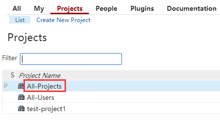
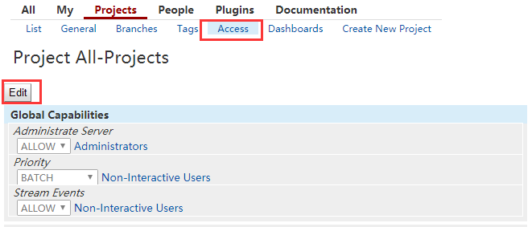
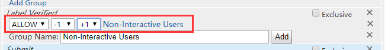
## jenkins配置
- **安装插件**
  jenkins需安装 SonarQube Scanner for Jenkins插件，Gerrit Trigger插件和Git plugin插件。
在“系统管理”->“插件管理"->”可选插件"->搜索上面的插件进行安装
- **系统配置**
  “主页面->系统管理->系统设置”，
  配置SonarQube servers（已提前部署）：
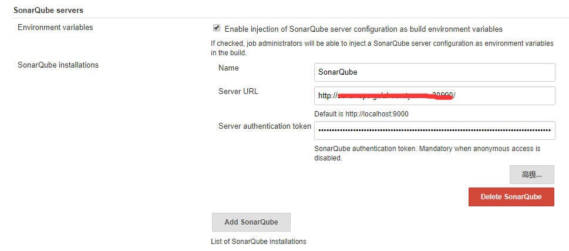
  配置Gerrit Trigger
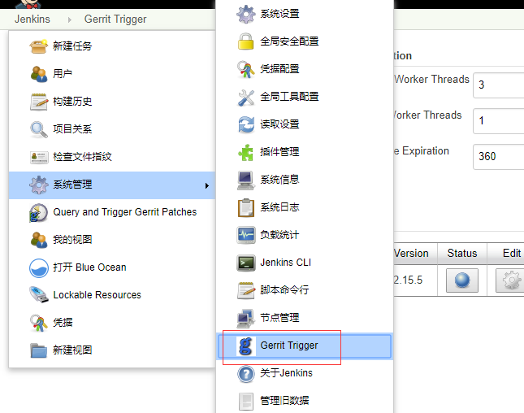
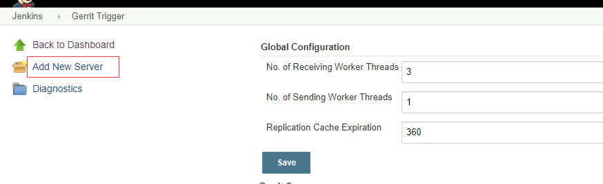
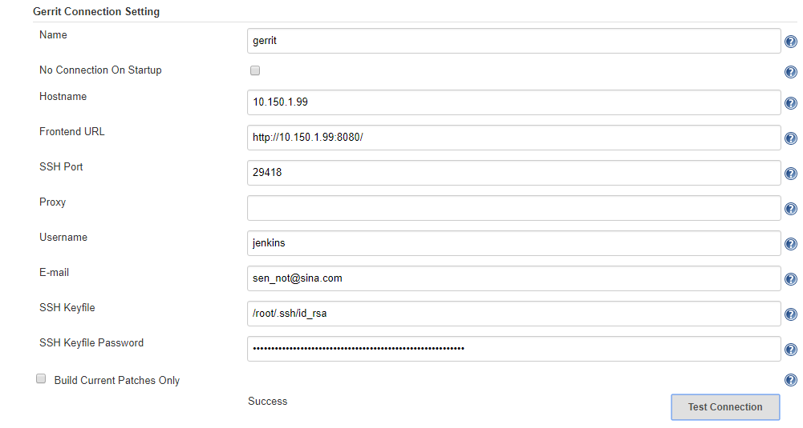
- **全局工具配置**
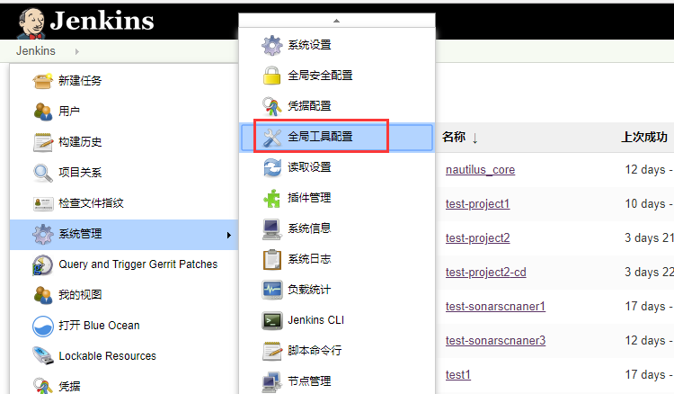
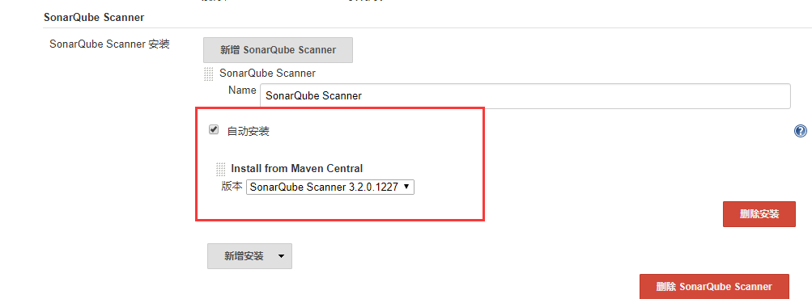  
## 测试
- jenkins新建项目
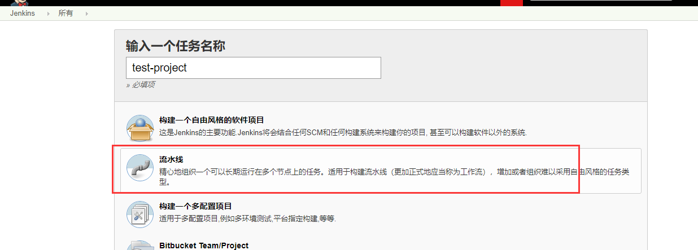
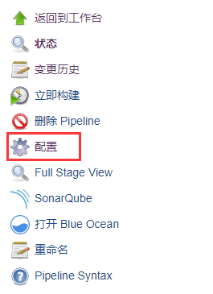 
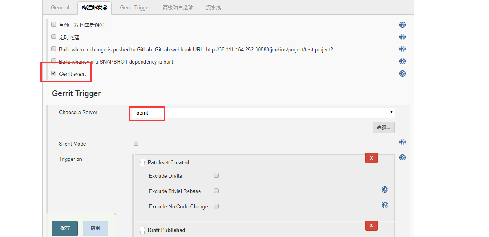 
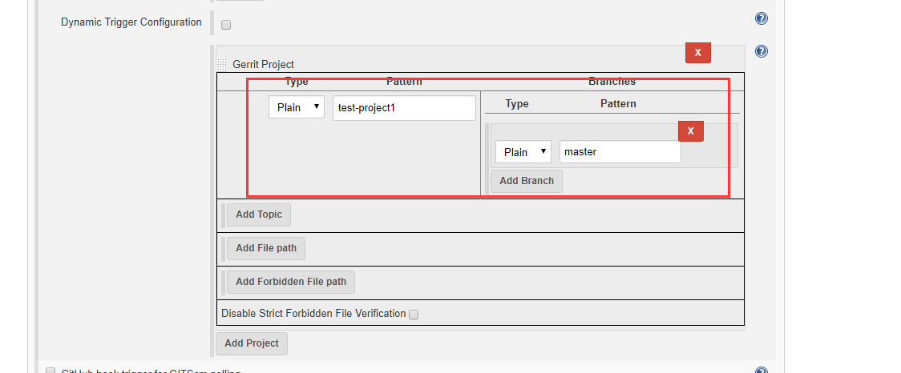 
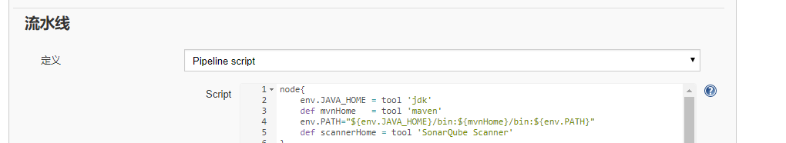 
pipeline示例
```
node{'
	def scannerHome = tool 'SonarQube Scanner'
}

    stage('SCM') {
        node {
        git (url: 'http://10.150.1.99:8080/p/test-project1.git',timeout:'600')
        def changeBranch = "change-${GERRIT_CHANGE_NUMBER}-${GERRIT_PATCHSET_NUMBER}"
        sh "git fetch origin ${GERRIT_REFSPEC}:${changeBranch}"
        sh "git checkout ${changeBranch}"
    }
    }
	stage('SonarQube analysis') {
     node{
        def sonarqubeScannerHome = tool name: 'SonarQube Scanner'
        withSonarQubeEnv('SonarQube') {
        sh "${sonarqubeScannerHome}/bin/sonar-scanner  -Dsonar.projectName=test-project1-1  -Dsonar.sources=.  -Dsonar.projectKey=test-project1-1"}
     }
    }
```

- 普通用户提交代码
```bash
[gxy@gerrit test-project1]$ echo "test2018" >> testfile 
[gxy@gerrit test-project1]$ git add .
[gxy@gerrit test-project1]$ git commit -m "change testfile"
[master d3b5c06] change testfile
 1 file changed, 1 insertion(+)
[gxy@gerrit test-project1]$ git review
remote: Processing changes: new: 1, done    
remote: 
remote: New Changes:
remote:   http://36.111.164.240:10083/#/c/test-project1/+/15 change testfile
remote: 
remote: Pushing to refs/publish/* is deprecated, use refs/for/* instead.
To ssh://gxy@36.111.164.240:29418/test-project1.git
 * [new branch]      HEAD -> refs/publish/master
```
- 查看
 jenkins：
 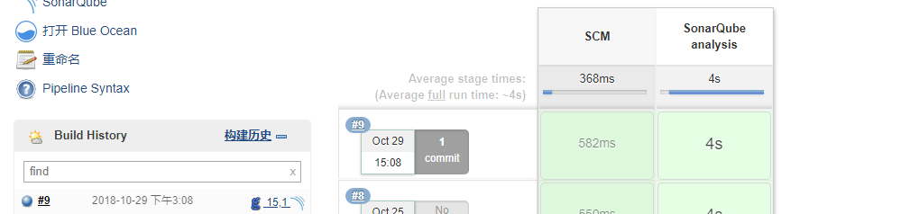
 sonar
 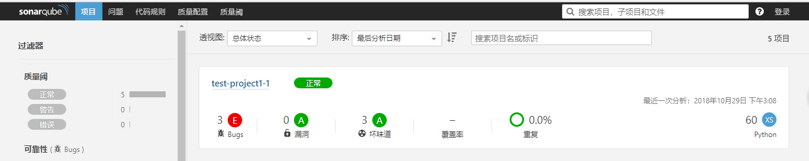
 gerrit
 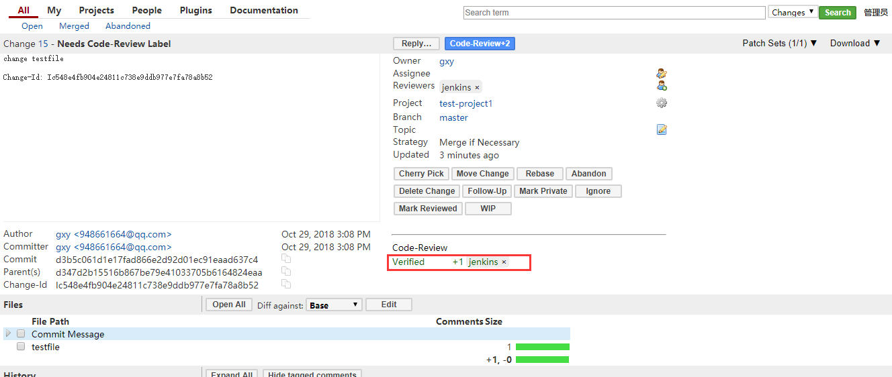

gerrit对接jenkins成功。