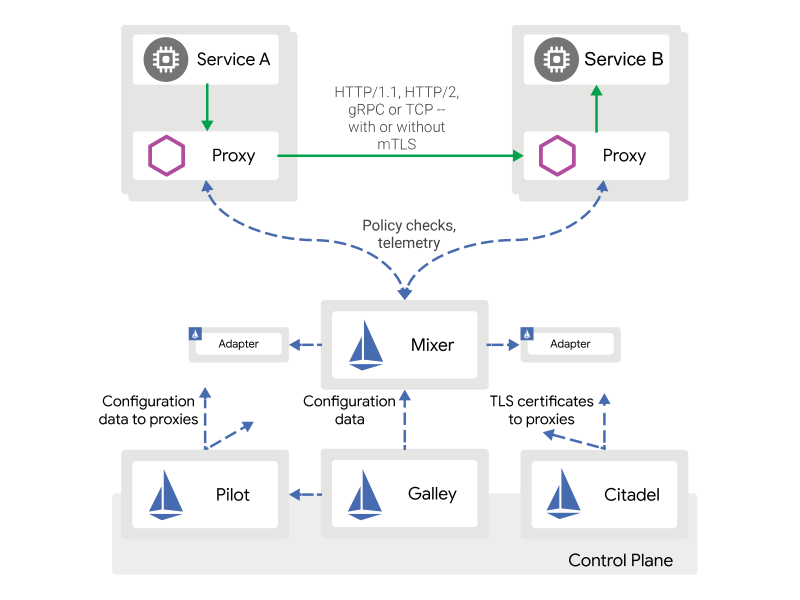
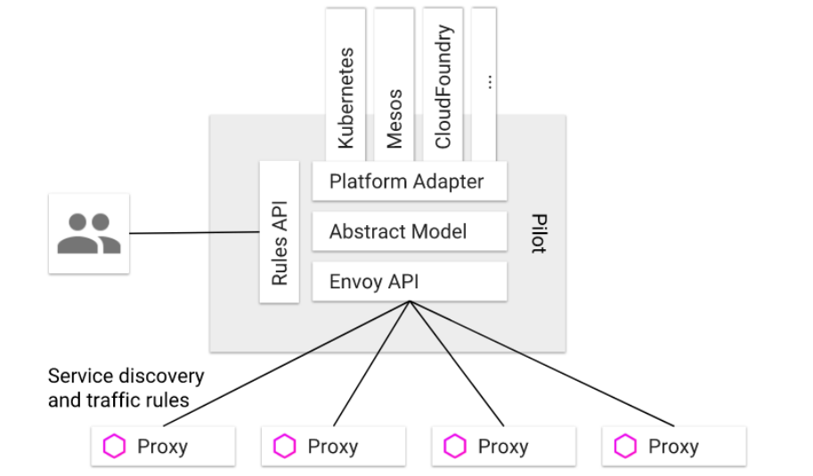
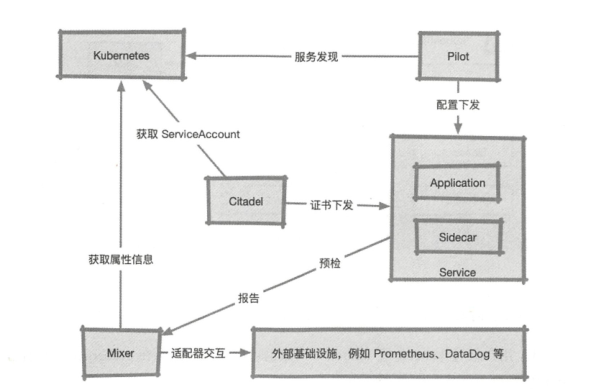
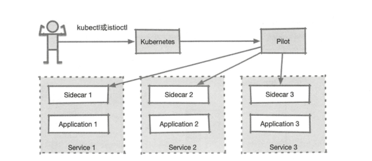
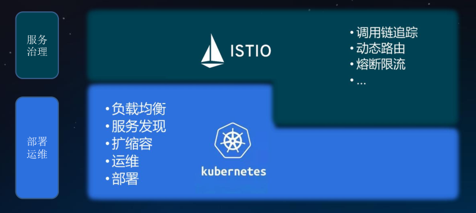

# istio

----------
## 架构

Istio服务网格在逻辑上分为数据平面和控制平面。

 -  数据平面：由一组的智能代理（的特使部署为侧柜）。这些代理与通用策略和遥测集线器Mixer一起协调和控制微服务之间的所有网络通信。
 -  控制平面：管理和配置代理来路由流量。此外，控制平面将混合器配置为执行策略并收集遥测。

## 特性
### 连接（Connect）

### 安全（Secure）

### 控制（Control）

### 观察（Observe）

## 组件

### 控制面

#### Pilot

- 功能：
  - 从kubernetes或其他平台的注册中心获取服务信息，完成服务发现过程
  - 读取istio的各项控制配置，在进行转换后，将其发给数据面进行实施

- 图解：

  - 

  

  

  - 
  - 
  - 
  - 

  

- 

#### Mixer

#### Citadel

### 数据面

#### Sidecar(Envoy)

## 能力
### 功能
- 流量管理
  - 负载均衡
  - 动态路由
  - 灰度发布
  - 故障注入
- 可观察性
  - 调用链
  - 访问日志
  - 监控
 - 策略执行
   - 限流
   - ACL 
 - 服务身份和安全
   - 认证
   - 鉴权 
### 扩展

- 平台支持
  - k8s
  - CloudFoundry
  - Eureka
  - Consul
- 集成和定制
  - ACL
  - 日志
  - 配额

## 使用

Istio + Kubernetes：云原生应用治理 + 云原生应用设施

