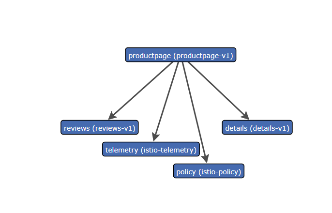
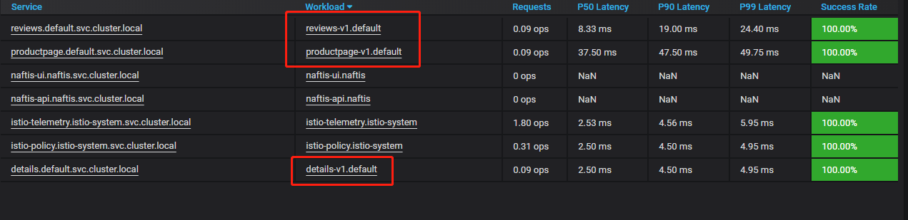
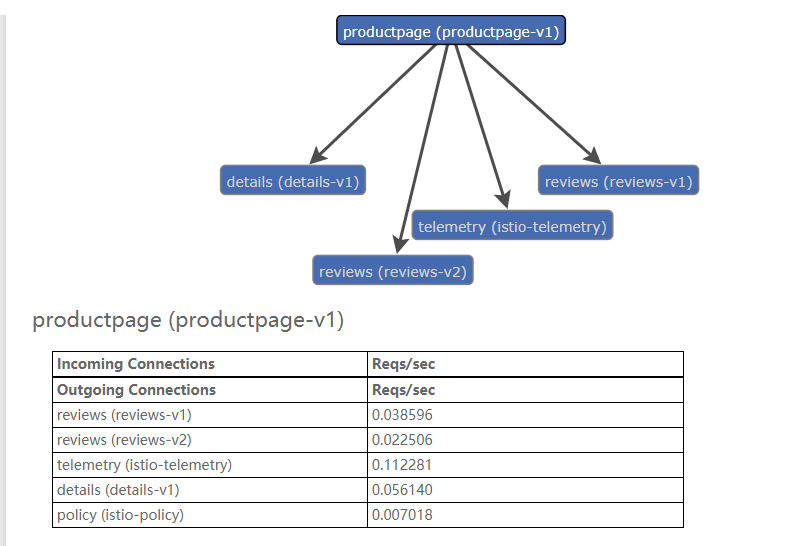

# 实验2-配置请求路由

## 01、  virtual service 将所有流量路由到每个微服务的 v1 版本 

### 进入yaml文件所在目录

`/root/istio/istio-1.4.0-beta.0/samples/bookinfo/networking`

###  应用 virtual service 

```shell
[root@vm115 networking]# kubectl apply -f virtual-service-all-v1.yaml 
virtualservice.networking.istio.io/productpage created
virtualservice.networking.istio.io/reviews created
virtualservice.networking.istio.io/ratings created
virtualservice.networking.istio.io/details created

```

*virtual-service-all-v1.yaml*

```yaml
apiVersion: networking.istio.io/v1alpha3
kind: VirtualService
metadata:
  name: productpage
spec:
  hosts:
  - productpage
  http:
  - route:
    - destination:
        host: productpage
        subset: v1
---
apiVersion: networking.istio.io/v1alpha3
kind: VirtualService
metadata:
  name: reviews
spec:
  hosts:
  - reviews
  http:
  - route:
    - destination:
        host: reviews
        subset: v1
---
apiVersion: networking.istio.io/v1alpha3
kind: VirtualService
metadata:
  name: ratings
spec:
  hosts:
  - ratings
  http:
  - route:
    - destination:
        host: ratings
        subset: v1
---
apiVersion: networking.istio.io/v1alpha3
kind: VirtualService
metadata:
  name: details
spec:
  hosts:
  - details
  http:
  - route:
    - destination:
        host: details
        subset: v1
---

```

### 刷新页面测试






## 02、基于用户身份的路由

接下来，您将更改路由配置，以便将来自特定用户的所有流量路由到特定服务版本。在这种情况下，来自名为 Jason 的用户的所有流量将被路由到服务 `reviews:v2`。

请注意，Istio 对用户身份没有任何特殊的内置机制。这个例子的基础在于， `productpage` 服务在所有针对 `reviews` 服务的调用请求中 都加自定义的 HTTP header，从而达到在流量中对最终用户身份识别的这一效果。

请记住，`reviews:v2` 是包含星级评分功能的版本。


###  运行以下命令以启用基于用户的路由 

`kubectl apply -f virtual-service-reviews-test-v2.yaml`

*virtual-service-reviews-test-v2.yaml*

```yaml
apiVersion: networking.istio.io/v1alpha3
kind: VirtualService
metadata:
  name: reviews
spec:
  hosts:
    - reviews
  http:
  - match:   # 匹配规则
    - headers:
        end-user:
          exact: jason
    route:
    - destination:
        host: reviews
        subset: v2
  - route:
    - destination:
        host: reviews
        subset: v1
```


### 登录测试

可以看到使用json用户登录的流量被路由到了v2，其余流量依然到v1。



> 在此任务中，您首先使用 Istio 将 100% 的请求流量都路由到了 Bookinfo 服务的 v1 版本。 然后再设置了一条路由规则，在 `productpage` 服务中添加了路由规则，这一规则根据请求的 `end-user` 自定义 header 内容，选择性地将特定的流量路由到了 `reviews` 服务的 `v2` 版本。
>
> 请注意，为了利用 Istio 的 L7 路由功能，Kubernetes 中的服务（如本任务中使用的 Bookinfo 服务）必须遵守某些特定限制。 参考 [sidecar 注入文档](https://archive.istio.io/v1.2/zh/docs/setup/kubernetes/additional-setup/requirements)了解详情。


## 清除

` kubectl delete -f virtual-service-all-v1.yaml`

