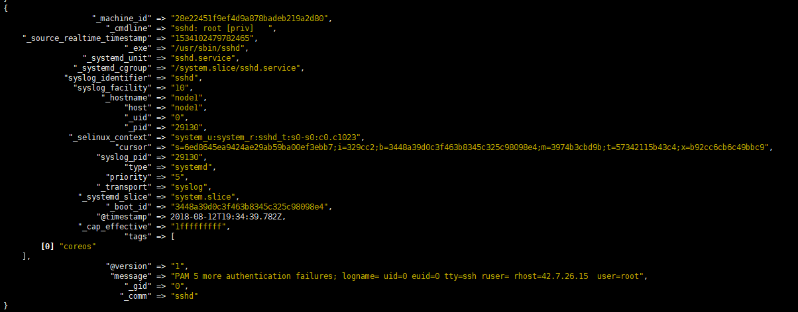

# logstash 收集 journald 的日志
##安装插件
- 安装ruby环境
  ```bash
yum -y install ruby
```
- 安装logstash-input-journald
```bash
#From source

git clone https://github.com/logstash-plugins/logstash-input-journald.git
cd logstash-input-journald
gem build logstash-input-journald.gemspec
sudo /path/to/logstash/bin/plugin install /path/to/git/logstash-input-journald/logstash-input-journald-*.gem


#From rubygems

sudo /path/to/logstash/bin/plugin install logstash-input-journald
```

##配置示例

```
input {
     journald {
       lowercase => true
       seekto => "head"
       path => "/run/log/journal"
       thisboot => true
       type => "systemd"
       tags => [ "coreos" ]
     }
}

output {
  stdout {codec => rubydebug}
}
```
## 测试
- 启动logstash
```bash
[root@node1 a.conf]#../bin/logstash -f journal2.conf
```
- 查看输出


##其他操作

###gem 更换源
```bash
gem sources  #列出默认源
gem sources --remove https://rubygems.org/  #移除默认源
gem sources -a https://mirrors.ustc.edu.cn/rubygems/  #添加科大源  https://gems.ruby-china.com
```

###ruby升级

```bash
#http://www.rvm.io/ 官网首页就可以看到 
 gpg --keyserver hkp://keys.gnupg.net --recv-keys 409B6B1796C275462A1703113804BB82D39DC0E3 7D2BAF1CF37B13E2069D6956105BD0E739499BDB
#下载rvm   
\curl -sSL https://get.rvm.io | bash -s stable 

#配置文件生效 
source /etc/profile.d/rvm.sh 
#下载rvm依赖 
rvm requirements 
#查看rvm库ruby版本 
rvm list known
#安装ruby指定版本 
rvm install ruby-2.4.1
#使用ruby版本默认 
rvm use 2.4.1 default


```
