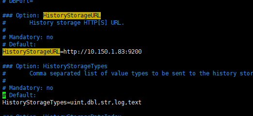
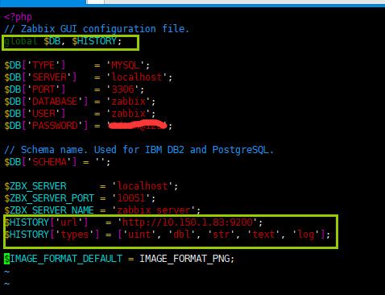
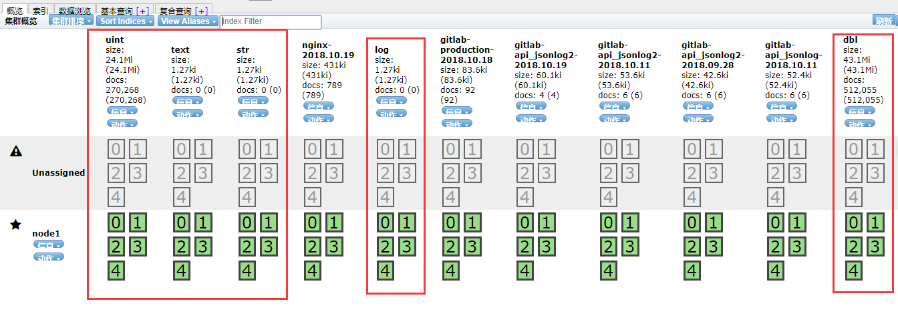
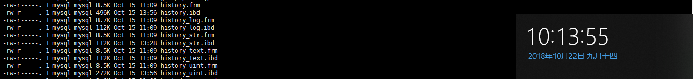
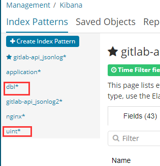
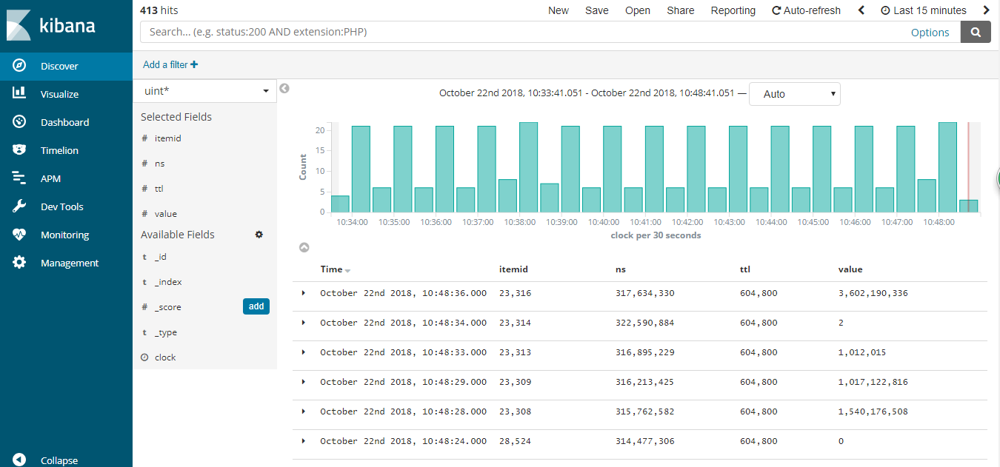
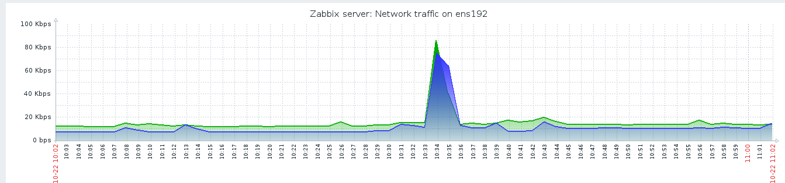

# Zabbix历史数据history存储到 Elasticsearch

## 前提
默认已安装好es和kibana
## 1、安装zabbix
可按照[zabbix官方文档](https://www.zabbix.com/download "zabbix官方文档")安装。
## 2、在es创建zabbix的索引
**依次创建uint、dbl、log、str、text索引**

示例创建uint索引


``` python
curl -X PUT \

 http://**ES Host IP**:9200/uint \

 -H 'content-type:application/json' \

 -d '{

   "settings" : {

      "index" : {

         "number_of_replicas" : 1,

         "number_of_shards" : 5

      }

   },

   "mappings" : {

      "values" : {

         "properties" : {

            "itemid" : {

               "type" : "long"

            },

            "clock" : {

               "format" : "epoch_second",

               "type" : "date"

            },

            "value" : {

               "type" : "long"

            }

         }

      }

   }

}'
```

## 3、配置zabbix server


- 配置zabbix server配置文件，添加

```text/plain
HistoryStorageURL=http://你的ip:9200
HistoryStorageTypes=uint,dbl,str,log,text
```


- 在zabbix的php前端配置里修改为：

```text/plain
global $DB;  -->  global $DB, $HISTORY;
```
添加
```text/plain
$HISTORY['url']   = 'http://你的ip:9200';
$HISTORY['types'] = ['uint', 'dbl', 'str', 'text', 'log'];
```


## 4、查看数据存储情况
可以发现数据已存储到es里，zabbix的MySQL的数据库数据不再增加。


## 5、kibana添加index patterns


## 6、查看zabbix数据显示是否正常
